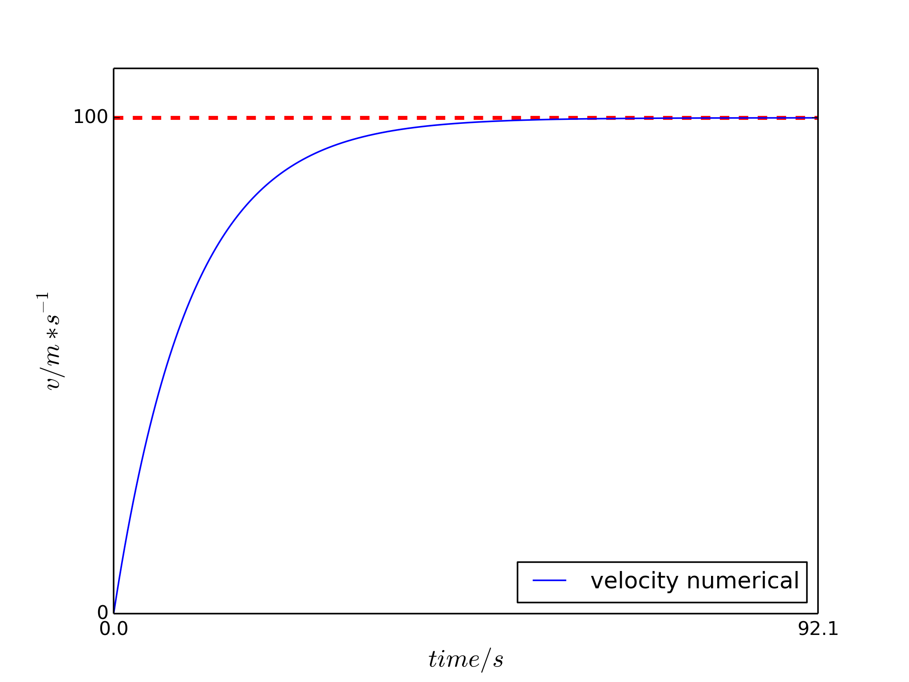
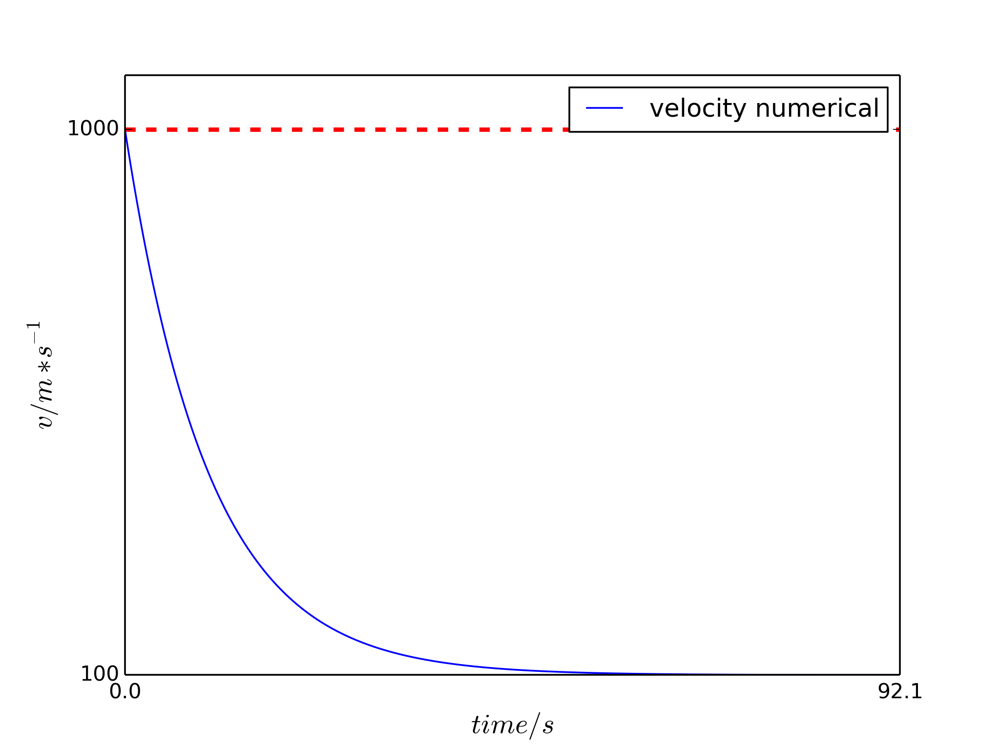

#Simple Air-Drag Model

##摘要

本次作业挑选`1.3-空气阻力问题`作为作业内容，给出了针对简单空气阻力问题的常微分方程的近似解决方案以及与真实值得对比。 

##背景介绍

考虑物体低速情况下在有空气阻力下运动，它的运动方程可以用以下公式描述

$$x=\frac{-b\pm\sqrt{b^2-4ac}}{2a}$$
\\(x=\frac{-b\pm\sqrt{b^2-4ac}}{2a}\\)

其中a是加速度，b是阻力的系数（b>0），当b=0时物体为匀加速运动。这里只考虑低速的近似情况，实际上用这个公式描述是有误差的。

##正文

###实现原理

####方程的精确解

利用常数变易法可解得（1）式解得形式为

$$x=\frac{-b\pm\sqrt{b^2-4ac}}{2a}$$
\\(x=\frac{-b\pm\sqrt{b^2-4ac}}{2a}\\)

其中c为待定系数。因为初速度是已知量，于是代入替换c可得

$$x=\frac{-b\pm\sqrt{b^2-4ac}}{2a}$$
\\(x=\frac{-b\pm\sqrt{b^2-4ac}}{2a}\\)

其中V0为初速度。

###方程的近似解

公式（1）还可以写成

$$x=\frac{-b\pm\sqrt{b^2-4ac}}{2a}$$
\\(x=\frac{-b\pm\sqrt{b^2-4ac}}{2a}\\)

若取dt为某一足够小的近似值，当已知N的初值N(t0)后多次迭代，便可得到之后所有的数值近似解。 

dv较小时停止程序。经过计算得出end_t = log(10000) / b，即在时结束计算，其中为v的渐进值；
程序实现

##python源码地址：air-drag_model
###结果分析
####数值解结果

当a = 10，b = 0.1，v(0) = 0 m/s时，结果如图所示  

当a = 10，b = 0.1，v(0) = 1000 m/s时，结果如图所示  

从图中可以看出，当时单调递减，反则单调递增，且v都趋近于常数，这与解析解的结果是一致的。

####数值解误差

 
 
对比图像可以看出，误差值与斜率呈正相关，这是因为在斜率大的地方dv的偏差要比斜率小的地方大，若缩小dt的值则会造成计算次数过多而影响性能。

##结论

根据误差值分析可以得出，在因变量二阶导的绝对值较大（即斜率变化较大）的情况下使用欧拉近似法会造成较大的误差。
